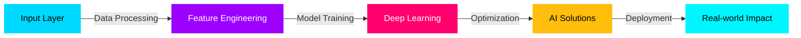

<div align="center">
  
</div>

<h1 align="center">
  
</h1>

<p align="center">
  
  
  
</p>

<div align="center">

```python
class AIDeveloper:
    def __init__(self):
        self.name = "Anurag Srivastav Thammera"
        self.role = "AI Developer & ML Engineer"
        self.location = "India 🇮🇳"
        self.current_project = "AspireX"
        
    def training_on(self):
        return [
            "Deep Learning",
            "Computer Vision", 
            "AI Agents",
            "Large Language Models",
            "Neural Networks"
        ]
    
    def tech_stack(self):
        return {
            "ai_frameworks": ["TensorFlow", "PyTorch", "Hugging Face"],
            "ml_tools": ["Scikit-learn", "Pandas", "NumPy"],
            "ai_platforms": ["LangChain", "Google Gen-AI", "OpenAI"],
            "deployment": ["Streamlit", "FastAPI", "Docker"],
            "cloud": ["AWS", "Azure", "GCP"]
        }
    
    def current_mission(self):
        return "Building AGI, One Model at a Time 🤖"

# Initialize AI Developer Instance
me = AIBuilder()
print(me.current_mission())
# >>> Building AGI, One Model at a Time 🤖
```

</div>

---

<div align="center">

## 🧠 AI/ML Neural Network



</div>

---

## 🤖 AI & Machine Learning Arsenal

<div align="center">

### 🔥 Core AI/ML Frameworks
<p>
  
  
  
  
  
</p>

### 🚀 LLMs & Generative AI
<p>
  
  
  
  
  
</p>

### 📊 Data Science & Visualization
<p>
  
  
  
  
  
</p>

### 🎯 Computer Vision & NLP
<p>
  
  
  
  
  
</p>

### ⚡ MLOps & Deployment
<p>
  
  
  
  
  
</p>

### ☁️ Cloud & AI Platforms
<p>
  
  
  
  
</p>

### 💻 Programming & Development
<p>
  
  
  
  
  
</p>

</div>

---

## 🚀 AI-Powered Projects

<div align="center">

<table>
<tr>
<td width="50%" valign="top">

### 🎙️ EchoClone AI
**`Generative AI` `Voice Cloning` `LLMs`**

[](https://echoclone-ai.streamlit.app/)
[](https://github.com/anurag-srivatsav/EchoClone-AI)

Advanced voice cloning system using state-of-the-art AI models and LangChain orchestration

```python
tech_stack = {
    "ai": ["Google Gen-AI", "LangChain"],
    "audio": ["PlayHT"],
    "ml": ["Hugging Face Transformers"],
    "framework": ["Streamlit", "Python"]
}
```

</td>
<td width="50%" valign="top">

### 🖥️ NeuroDesk
**`AI Assistant` `NLP` `Neural Networks`**

[](https://neurodeskai.netlify.app/)
[](https://github.com/anurag-srivatsav/Desktop_AI)

Intelligent desktop assistant powered by LLMs with natural language understanding

```python
tech_stack = {
    "frontend": ["React.js", "JavaScript"],
    "backend": ["Node.js", "Python"],
    "ai": ["LLM", "LangChain"],
    "data": ["SQL", "Hugging Face"]
}
```

</td>
</tr>

<tr>
<td width="50%" valign="top">

### 💼 AI Portfolio
**`Web AI` `Interactive` `Modern UI`**

[](https://anuragsrivatsav4.netlify.app/)
[](https://github.com/anurag-srivatsav/MyPortfolio)

AI-enhanced portfolio with intelligent interactions and modern design

```python
tech_stack = {
    "frontend": ["React", "HTML5", "CSS3"],
    "backend": ["Node.js"],
    "ai": ["AI Integration"]
}
```

</td>
<td width="50%" valign="top">

### 📱 iGita Application
**`Full Stack` `AI Features` `Web App`**

[](https://igita.netlify.app/home.html)
[](https://github.com/anurag-srivatsav/iGita-Application)

Modern web application with integrated AI capabilities

```python
tech_stack = {
    "frontend": ["React", "HTML"],
    "backend": ["Node.js"],
    "features": ["AI Integration"]
}
```

</td>
</tr>
</table>

</div>

---

## 📈 Model Performance Metrics

<div align="center">


</div>

---

## 🏆 Achievement Unlocked

<div align="center">
  
</div>

---

## 🎯 Training Objectives

<div align="center">

```ascii
╔══════════════════════════════════════════════════════════════╗
║                                                              ║
║  [████████████████████████████████████░░░░] 85%             ║
║  Deep Learning Mastery                                      ║
║                                                              ║
║  [██████████████████████████████████████░░] 90%             ║
║  Computer Vision Expertise                                  ║
║                                                              ║
║  [████████████████████████████░░░░░░░░░░] 70%               ║
║  AI Agent Development                                       ║
║                                                              ║
║  [██████████████████████████████████████████] 95%           ║
║  Machine Learning Deployment                                ║
║                                                              ║
╚══════════════════════════════════════════════════════════════╝
```

</div>

---

## 🔗 Neural Connection Ports

<div align="center">

<p>
  <a href="https://linkedin.com/in/anuragsrivatsav">
    
  </a>
  <a href="https://x.com/AnuragSrivatsa4">
    
  </a>
  <a href="https://instagram.com/anuragsrivatsav4">
    
  </a>
  <a href="mailto:anuragsrivatsav4@gmail.com">
    
  </a>
</p>

### 📄 [Download Neural Weights (Resume)](https://drive.google.com/file/d/1ePE_Yf5fQCuJbUMjXxQ0gHTUAE4f9LOj/view)

</div>

---

<div align="center">

### 💭 AI Wisdom of the Day


</div>

---

<div align="center">

```python
def life_motto():
    return """
    while True:
        learn()
        code()
        build_ai()
        repeat()
    
    # "The future belongs to those who believe 
    # in the beauty of artificial intelligence" 🤖
    """

print(life_motto())
```


**⚡ Powered by Neural Networks & Endless Curiosity**

</div>
